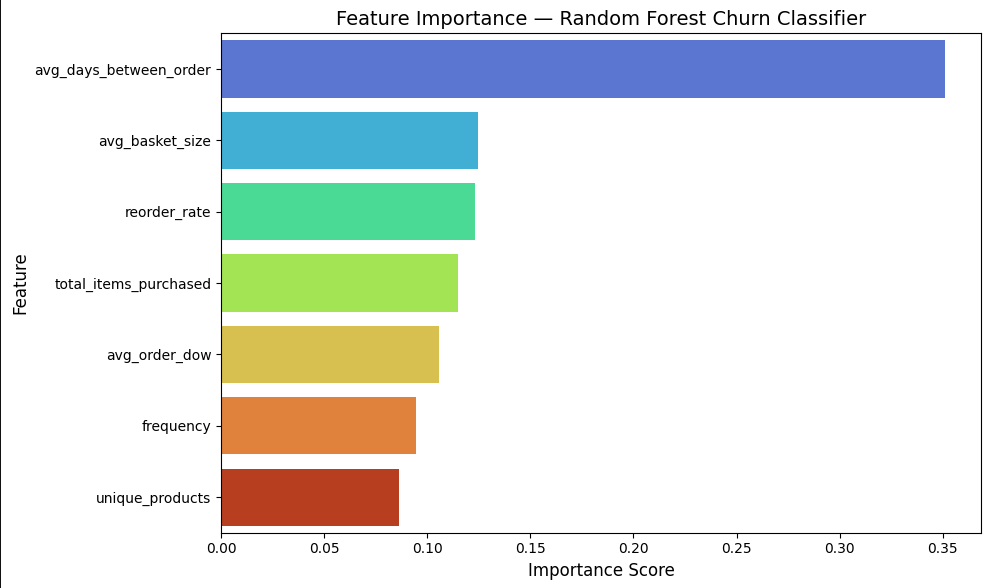

# Customer Churn Prediction | Instacart Grocery Data

Predicting which customers are about to stop ordering — and segmenting 200k+ users into actionable risk tiers using real Instacart transaction data.

---

## What This Project Does

I built an end-to-end churn prediction pipeline on 32 million real grocery transactions from Instacart. The goal was simple: given a customer's full order history, can we predict whether they're likely to churn — and if so, how do we prioritize who to reach out to first?

The final output is a scored customer table with four risk tiers (Very Active, Active, At Risk, Churned) that a marketing or retention team could plug directly into a campaign tool.

---

## Dataset

**Source:** [Instacart Online Grocery Shopping Dataset](https://www.kaggle.com/datasets/yasserh/instacart-online-grocery-basket-analysis-dataset) via Kaggle

- 206,209 unique customers
- 3.4 million orders
- 32 million order-product records
- 6 relational tables (orders, products, aisles, departments, prior, train)

No dollar amounts in this dataset — so monetary value is proxied through basket size and ordering frequency, which is actually more realistic for a subscription-style grocery app.

---

## Approach

### 1. Feature Engineering
I built 7 behavioral features from raw transaction history:

| Feature | Description |
|---|---|
| `frequency` | Total number of orders placed |
| `avg_basket_size` | Average products per order |
| `reorder_rate` | % of products that are reorders |
| `unique_products` | Total distinct products ever bought |
| `avg_days_between_order` | Typical gap between orders |
| `total_items_purchased` | Lifetime items purchased |
| `avg_order_dow` | Preferred day of week to order |

### 2. Churn Definition
A customer is labeled churned if their most recent order was 30+ days ago. This maps to real grocery behavior — active Instacart users typically order every 1-2 weeks.

### 3. Model Development
I trained two classifiers and iterated on features to improve performance:

| Model | ROC-AUC |
|---|---|
| Logistic Regression v1 (4 features) | 0.6983 |
| Random Forest v1 (4 features) | 0.6478 |
| Logistic Regression v2 (7 features) | **0.8318** |
| Random Forest v2 (7 features) | 0.8214 |

The biggest performance jump came from feature engineering — not from switching models. Adding `avg_days_between_order` alone drove most of the improvement.

### 4. Feature Importance
`avg_days_between_order` was the strongest churn predictor by a large margin (35% importance), which makes intuitive sense — a customer who suddenly starts taking longer between orders is showing early signs of disengagement.



### 5. Customer Risk Segmentation

| Risk Tier | Customers | Avg Orders | Avg Basket Size |
|---|---|---|---|
| Very Active | 84,359 | 22.5 | 12.0 |
| Active | 45,504 | 13.8 | 12.1 |
| At Risk | 22,958 | 11.0 | 11.8 |
| Churned | 53,388 | 8.2 | 11.3 |

26% of customers have churned. Notably, basket size stays consistent across all tiers — churn is driven by ordering frequency, not cart size.

---

## Key Findings

- **Feature engineering matters more than model choice** — switching from 4 to 7 features improved ROC-AUC by 19%, while switching from Logistic Regression to Random Forest had minimal effect.
- **Ordering cadence is the #1 churn signal** — how often someone orders predicts churn better than what they buy.
- **53,388 customers have churned** — representing the primary retention opportunity.
- **Logistic Regression outperformed Random Forest** on this dataset after feature enrichment, achieving higher ROC-AUC (0.8318 vs 0.8214) and significantly better churn recall (75% vs 40%).

---

## Tech Stack

- **Python** — Pandas, NumPy, Scikit-learn, Matplotlib, Seaborn
- **Models** — Logistic Regression, Random Forest (scikit-learn)
- **Notebook** — Jupyter

---

## Files

```
├── Customer_Churn_Prediction_Instacart.ipynb  ← main notebook
├── customer_risk_scores.csv                   ← scored customer table (output)
├── churn_model.pkl                            ← trained model
└── README.md
```

---

## How to Run

1. Download the dataset from [Kaggle](https://www.kaggle.com/datasets/yasserh/instacart-online-grocery-basket-analysis-dataset)
2. Place all 6 CSV files in the same folder as the notebook
3. Run all cells top to bottom

```bash
pip install pandas numpy scikit-learn matplotlib seaborn
```

---

## What I'd Do Next

- Add XGBoost and compare against Logistic Regression
- Build a Tableau dashboard on top of `customer_risk_scores.csv`
- Experiment with a time-based train/test split for more realistic evaluation
- Connect to Snowflake for scalable data ingestion
